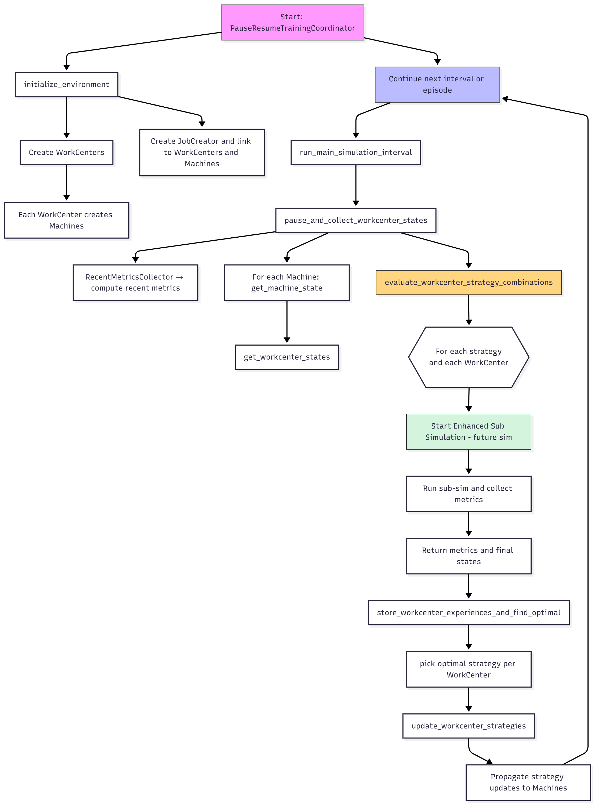

# 🏭 FJJSP Simulation — Pause-Resume Training Framework

### Overview

This project simulates a **Flow Shop / Flexible Job Shop (FJJSP)** environment with multiple **WorkCenters** and **Machines**.  
It is designed for **testing and comparing different scheduling and sequencing strategies** in dynamic production systems.  

Researchers can use this simulation framework to:
- Experiment with job-shop scheduling policies.
- Test sequencing and (later) routing strategies.
- Collect performance metrics (e.g., makespan, throughput, tardiness) under various configurations.

---

## 🔧 Key Components

### **PauseResumeTrainingCoordinator**
This class orchestrates the entire simulation. It runs the main simulation in time intervals, pauses to collect states, performs short “future” sub-simulations to evaluate alternative strategies, and updates WorkCenter strategies based on observed performance.

### **WorkCenters & Machines**
- Each **WorkCenter** manages multiple **Machines**.  
- Each Machine executes jobs according to the currently selected **sequencing strategy** (e.g., FIFO, SPT, EDD).  
- In future versions, a **Routing Agent** will be added to decide which WorkCenter incoming jobs should go to.  
  (Currently, jobs are assigned to the **first available machine**.)

---

## ⚙️ How It Works (High-Level Flow)

1. **Initialization**
   - `PauseResumeTrainingCoordinator` is created.
   - `initialize_environment()` sets up WorkCenters and Machines.
   - `JobCreator` is instantiated and linked to the WorkCenters.

2. **Training Loop**
   - `train()` runs over multiple **episodes** and **intervals**:
     1. `run_main_simulation_interval()` → runs the simulation for a fixed time period.
     2. `pause_and_collect_workcenter_states()` → gathers metrics and machine states.
     3. `evaluate_workcenter_strategy_combinations()` → performs short sub-simulations to test different strategies.
     4. `store_workcenter_experiences_and_find_optimal()` → stores experience data and selects the best strategy per WorkCenter.
     5. `update_workcenter_strategies()` → applies the optimal strategies and continues training.




---

## ▶️ How to Run

### **1️⃣ Create and Activate Conda Environment**
```bash
conda create -n fj_env python=3.10 -y
conda activate fj_env
conda install -c conda-forge simpy ipykernel -y
python -m ipykernel install --user --name fj_env --display-name "Python (fj_env)"
