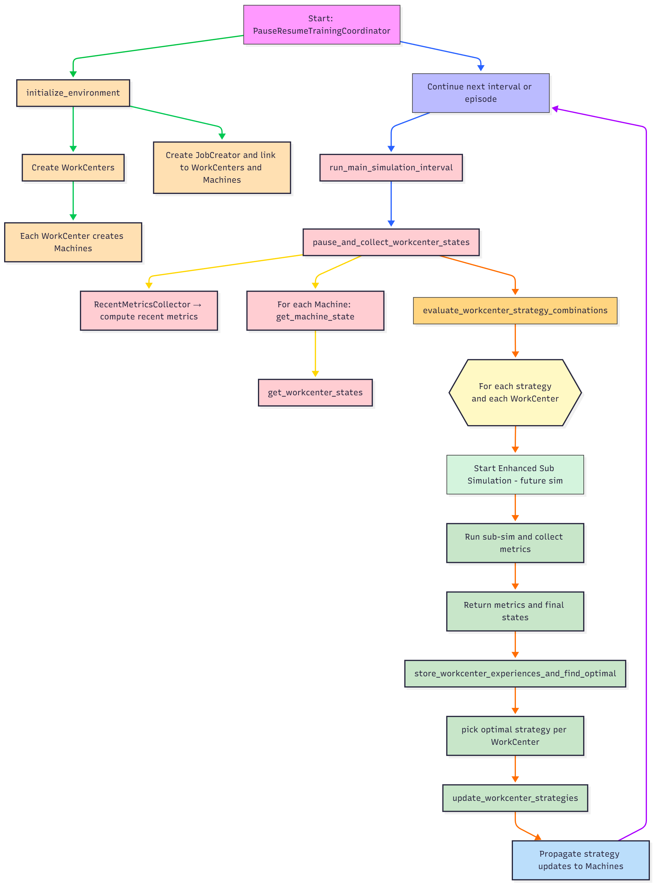

# 🏭 FJJSP Simulation — Pause-Resume Training Framework

### Overview

This project simulates a **Flow Shop / Flexible Job Shop (FJJSP)** environment with multiple **WorkCenters** and **Machines**.  
It is designed for **testing and comparing different scheduling and sequencing strategies** in dynamic production systems.  

Researchers can use this simulation framework to:
- Experiment with job-shop scheduling policies.
- Test sequencing and (later) routing strategies.
- Collect performance metrics (e.g., makespan, throughput, tardiness) under various configurations.

---

## 🔧 Key Components

### **Architecture overview**
- `main.py` bootstraps the simulation by instantiating `PauseResumeTrainingCoordinator` and displaying the layout.
- `coordinator/training_coordinator.py` hosts the pause-resume training coordinator and orchestrates calls into the other packages.
- `simulation/` contains the SimPy models (`WorkCenter`, `Machine`, `JobCreator`, and helpers such as `EnhancedSubSimulation`).
- `memory/workcenter_experience.py` keeps the experience replay buffers used by the coordinator.
- `metrics/` maintains the metrics collectors (`MetricsCollector`, `RecentMetricsCollector`).
- `agent/`, `state/`, `reward/`, and `utils/` provide supporting helpers for a future RL-driven rollout (DQN agent + epsilon scheduler, state vectorization, reward computation, and logging utilities, respectively).
- This separation keeps the simulator ignorant of RL logic while the coordinator can orchestrate the policy search/training loop described below.

### **WorkCenters & Machines**
- Each **WorkCenter** manages multiple **Machines**.
- Each Machine executes jobs according to the currently selected **sequencing strategy** (`FIFO`, `SPT`, `EDD`, `LPT`, `FIS`).

---

## ⚙️ How It Works (High-Level Flow)

1. **Initialization**
   - `PauseResumeTrainingCoordinator` is created.
   - `initialize_environment()` sets up WorkCenters and Machines.
   - `JobCreator` is instantiated and linked to the WorkCenters.

2. **Training Loop**
   - `train()` runs over multiple **episodes** and **intervals**:
     1. `run_main_simulation_interval()` → runs the simulation for a fixed time period.
     2. `pause_and_collect_workcenter_states()` → gathers metrics and machine states.
     3. `evaluate_workcenter_strategy_combinations()` → performs short sub-simulations to test different strategies.
     4. `store_workcenter_experiences_and_find_optimal()` → stores experience data and selects the best strategy per WorkCenter.
     5. `update_workcenter_strategies()` → applies the optimal strategies and continues training.




---

## ▶️ How to Run

### **1️⃣ Create and Activate Conda Environment**
```bash
conda create -n fj_env python=3.10 -y
conda activate fj_env
conda install -c conda-forge simpy ipykernel -y
python -m ipykernel install --user --name fj_env --display-name "Python (fj_env)"
